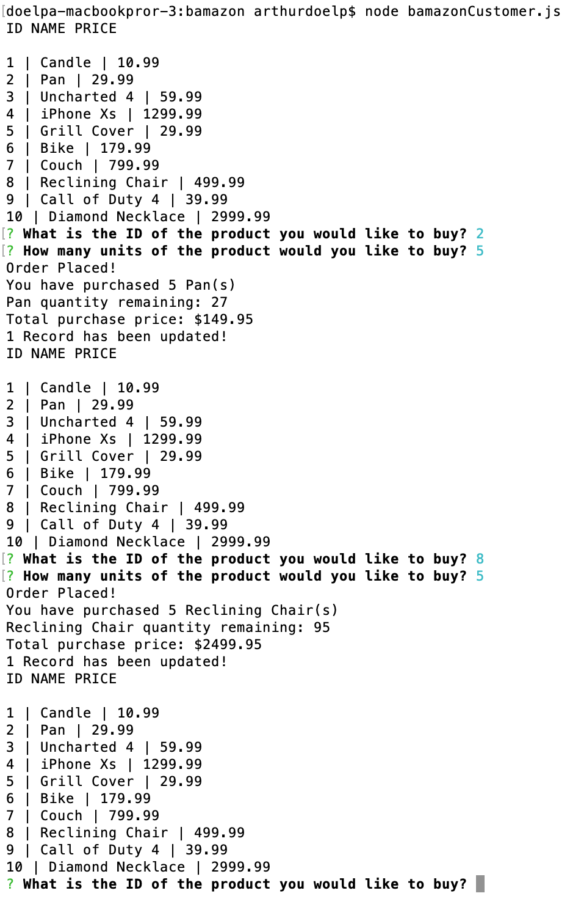

# bamazon

# Overview

For this project I created a simple order management system through the CLI.  This app when run through node will display a list of products that were stored in a mySQL database. using the inquirer npm package, the user is prompted to choose the product they would like to purchase from the options.  The user is then prompted with the quantity of the items to purchase.  The app will then update the respective row in the database the balance of items left in stock.  The user is then told the total price of the purchase and a success message for the successful transaction.  At this point the app restarts and again prompts the user to purchase another set of items etc.

See below for screenshots of the app running in the CLI:
